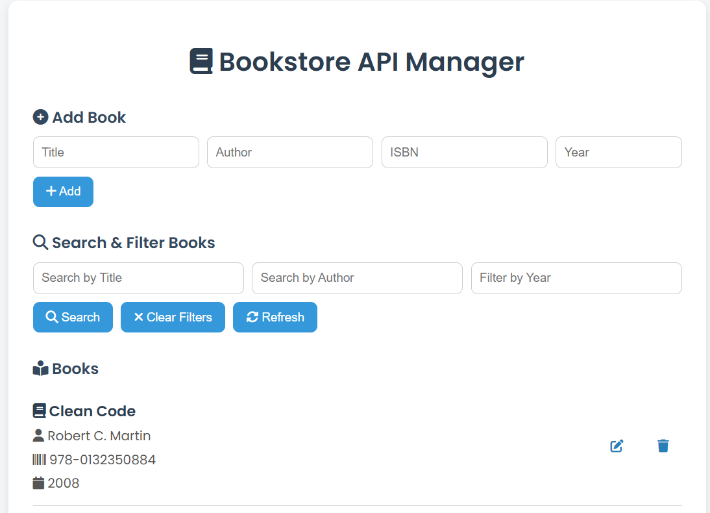
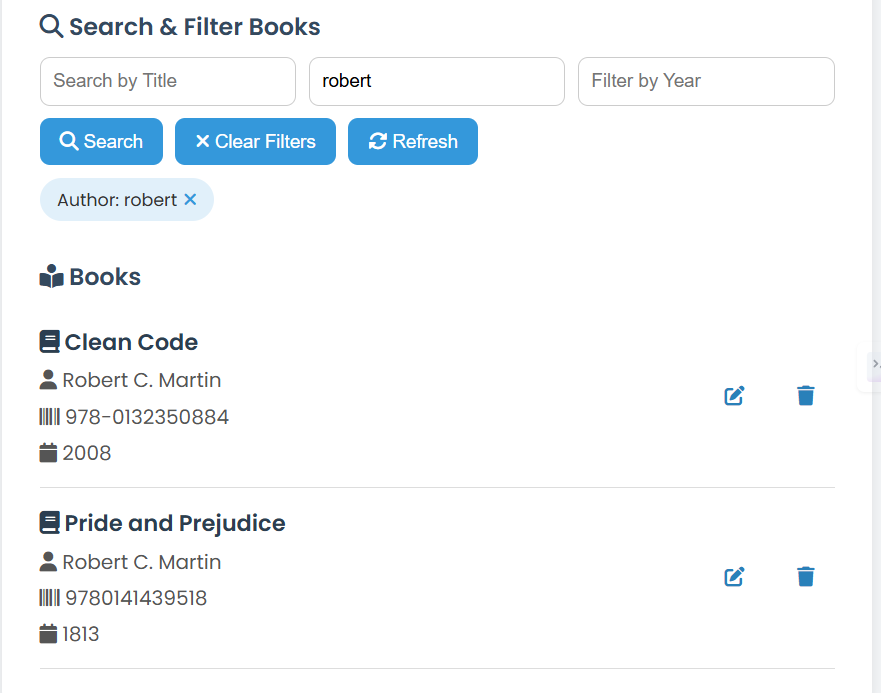
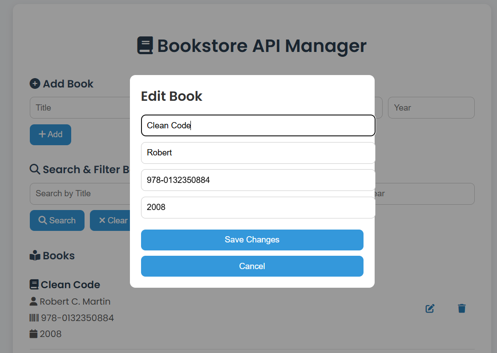
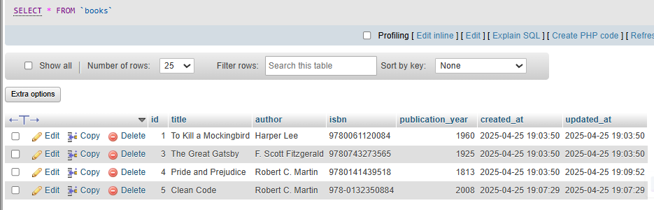

# 📚 Bookstore Manager

Bookstore Manager is a web-based application that allows users to manage a collection of books. It provides features to add, edit, delete, and search for books using a simple and intuitive interface. The backend is powered by PHP and MySQL, while the frontend is built with HTML, CSS, and JavaScript.

## Features

- Add new books with details like title, author, ISBN, and publication year.
- Edit existing book details.
- Delete books from the collection.
- Search and filter books by title, author, or publication year.
- Responsive and user-friendly design.

---

## Setup Guide

Follow these steps to set up the project on your local machine:

### Prerequisites

1. **XAMPP** or any other local server with PHP and MySQL support.
2. A web browser to access the application.

---

### Installation Steps

1. **Clone or Download the Repository**
   - Clone the repository or download the project files and place them in the `htdocs` folder of your XAMPP installation. For example:
     ```
     c:\xampp\htdocs\bookstore
     ```

2. **Set Up the Database**
   - Open phpMyAdmin (usually accessible at `http://localhost/phpmyadmin`).
   - Create a new database named `bookstore`.
   - Import the SQL file to create the required tables. You can use the following SQL to create the `books` table:
     ```sql
     CREATE TABLE books (
         id INT AUTO_INCREMENT PRIMARY KEY,
         title VARCHAR(255) NOT NULL,
         author VARCHAR(255) NOT NULL,
         isbn VARCHAR(50) NOT NULL,
         publication_year INT
     );
     ```

3. **Configure Database Connection**
   - Open the file `api/db_config.php` and ensure the database credentials match your local setup:
     ```php
     define('DB_SERVER', 'localhost');
     define('DB_USERNAME', 'root');
     define('DB_PASSWORD', '');
     define('DB_NAME', 'bookstore');
     ```

4. **Start the Server**
   - Start Apache and MySQL from the XAMPP control panel.
   - Access the application in your browser at:
     ```
     http://localhost/bookstore
     ```

---

## Project Structure

Below is the structure of the project files:

```
bookstore
├── api
│   ├── book.php
│   ├── search.php
│   └── db_config.php
|── index.html
├── style.css

```

---


## Usage

1. **Add Books**: Use the "Add Book" section to add new books to the collection.
2. **Search and Filter**: Use the search and filter options to find specific books.
3. **Edit or Delete**: Use the edit and delete buttons next to each book to modify or remove them.

---


## Screenshots

Below are some screenshots of the project to give you a quick preview:

1. **Homepage**  
   

2. **Search Results**  
   

3. **Edit Book Form**  
   

4. **Database View**  
   


---

## Usage

1. **Add Books**: Use the "Add Book" section to add new books to the collection.
2. **Search and Filter**: Use the search and filter options to find specific books.
3. **Edit or Delete**: Use the edit and delete buttons next to each book to modify or remove them.

---

## Troubleshooting

- **Database Connection Issues**: Ensure the database credentials in `db_config.php` are correct and the MySQL server is running.
- **CORS Errors**: If accessing the API from a different domain, ensure proper CORS headers are set in the PHP files.

---

## License

This project is open-source and available for personal or educational use.